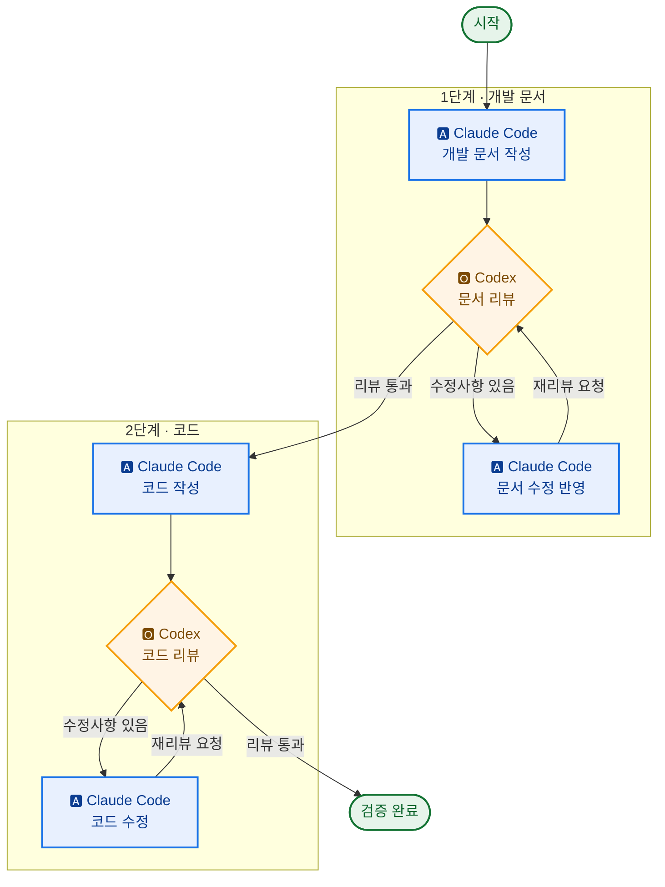

```mermaid
flowchart TD
    Start([시작]) --> A

    subgraph DOC [1단계 · 개발 문서]
        A["🅰 Claude Code<br/>개발 문서 작성"]
        B{"🅾 Codex<br/>문서 리뷰"}
        C["🅰 Claude Code<br/>문서 수정 반영"]
        A --> B
        B -->|수정사항 있음| C
        C -->|재리뷰 요청| B
    end

    B -->|리뷰 통과| D

    subgraph CODE [2단계 · 코드]
        D["🅰 Claude Code<br/>코드 작성"]
        E{"🅾 Codex<br/>코드 리뷰"}
        F["🅰 Claude Code<br/>코드 수정"]
        D --> E
        E -->|수정사항 있음| F
        F -->|재리뷰 요청| E
    end

    E -->|리뷰 통과| End([검증 완료])

    classDef write fill:#E8F0FE,stroke:#1A73E8,stroke-width:2px,color:#0B3D91
    classDef review fill:#FFF4E5,stroke:#F59E0B,stroke-width:2px,color:#7C4A03
    classDef done fill:#E6F4EA,stroke:#137333,stroke-width:2px,color:#0D652D

    class A,C,D,F write
    class B,E review
    class Start,End done
```
